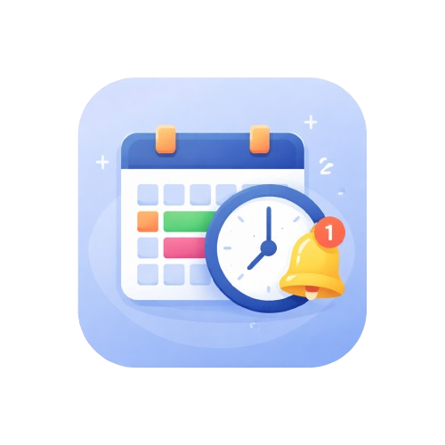

# Timecloud - College Timetable App



A beautiful Flutter mobile application for managing your weekly college timetable with offline support and smart notifications.

## ✨ Features

- 📅 **Weekly Timetable Management** - Create your schedule once, it repeats automatically every week
- 🔔 **Smart Notifications** - Get reminded before each class starts
- 📱 **Offline First** - Works completely offline, no internet required
- 🎨 **Beautiful UI** - Modern Material 3 design with color-coded subjects
- ⏰ **Time-Based Sorting** - Subjects automatically sorted chronologically
- 🔄 **Real-Time Updates** - Changes reflect instantly across the app
- 💾 **Local Storage** - All data stored securely on your device

## 📥 Download

Download the latest APK: [Timecloud Latest APK](https://github.com/BIPINRVANJARA/Time-Table.app/raw/main/releases/app-latest.apk)

## 🌐 Web Admin Panel

Manage subjects and timetables directly from your browser:
**[Launch Web Admin Panel](https://BIPINRVANJARA.github.io/Time-Table.app/)**

## 🚀 Getting Started

### Installation

1. Clone the repository:
```bash
git clone https://github.com/BIPINRVANJARA/Time-Table.app.git
cd Time-Table.app
```

2. Install dependencies:
```bash
flutter pub get
```

3. Run the app:
```bash
flutter run
```

## 🏗️ Building from Source

```bash
flutter build apk --release
```

## 🛠️ Tech Stack

- **Framework:** Flutter
- **Language:** Dart
- **Local Storage:** Hive (NoSQL database)
- **Notifications:** flutter_local_notifications
- **UI:** Material 3 Design

## 👨‍💻 Developer

**Bipin R Vanjara**
- GitHub: [@BIPINRVANJARA](https://github.com/BIPINRVANJARA)

---

**Made with ❤️ for students who never want to miss a class**
